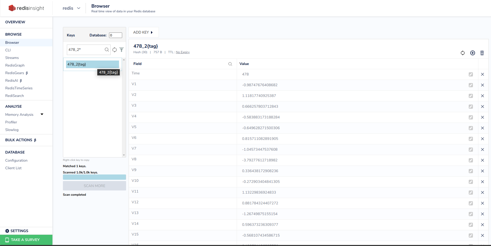
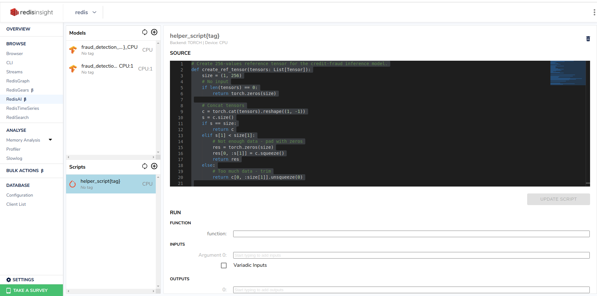
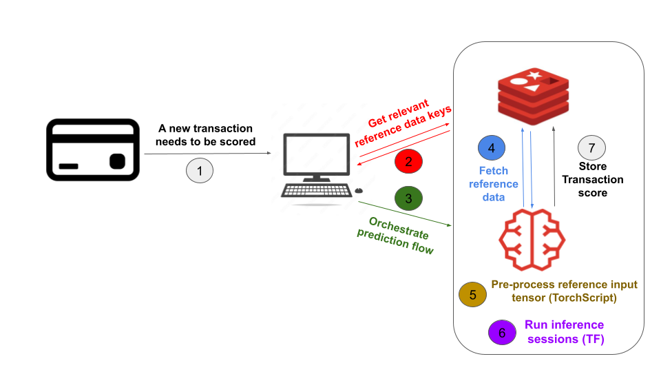
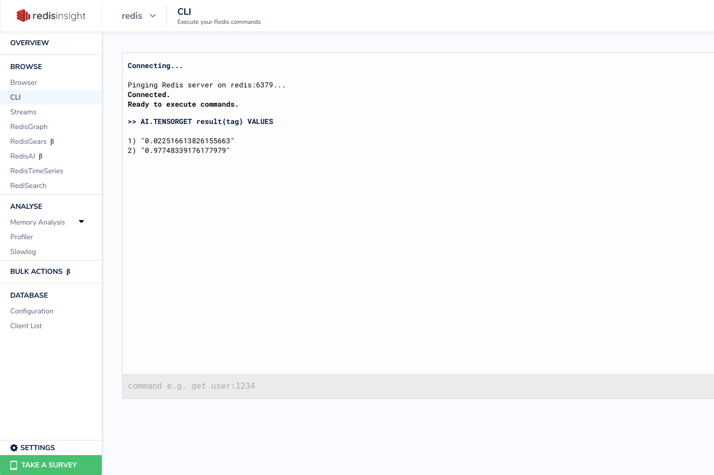

[](https://github.com/RedisAI/FraudDetectionDemo)
[](https://github.com/RedisAI/FraudDetectionDemo/actions/workflows/ci-config.yml)
[](https://forum.redislabs.com/c/modules/redisai)
[](https://discord.gg/rTQm7UZ)

# Fraud Detection Demo    

This demo illustrates the key advantage of data locality using [RedisAI](https://oss.redislabs.com/redisai/). Generating a prediction from a real-time AI/ML model is a multi-step process. The steps typically include: receiving a prediction (inference) request, retrieving feature data (needed by the mode)l and running the inference request (feeding features into model). In general, these steps run in multiple processes/machines. In contrast, using Redis and the RedisAI module allows you store feature data and run the AI Model in Redis! The feature data is within easy reach of the model!
This demo simulates a fraud-detection app, which relies on a ML model returning the probability that a given transaction is fraudulent. The model uses transaction data and reference (feature) data previously stored in Redis for the customers. The entire flow is executed within Redis.

## Running the Demo
To run the demo app and load the data, run the following commands:
```
# If you don't have it already, install https://git-lfs.github.com/ (On OSX: brew install git-lfs)
$ git lfs install && git lfs fetch && git lfs checkout

# Clone the repository
$ git clone https://github.com/RedisAI/FraudDetectionDemo.git
$ cd FraudDetectionDemo

# Launch the demo with docker-compose (may require sudo in linux)
$ docker-compose up
```
If something went wrong, e.g. you skipped installing git-lfs, you need to force docker-compose to rebuild the containers
```
$ docker-compose up --force-recreate --build
```

## Architecture
### RedisAI
Redis instance is launched with RedisAI module loaded (by running `redislabs/redisai:latest` docker). RedisAI allows you to store and execute AI/ML pre-trained models in Redis. The models can be written in Pytorch, Tensorflow or any other ML framework (XGBoot, scikit-learn) allowing models to be exported to ONNX.

### [Data Loader](https://github.com/RedisAI/FraudDetectionDemo/blob/master/dataloader/load.py)
Historical feature data of credit card transactions is loaded into Redis from [`data/creditcard.csv` file](https://media.githubusercontent.com/media/RedisAI/FraudDetectionDemo/master/dataloader/data/creditcard.csv), using redis-py (Redis' official python client). Every transaction is [stored in Redis](https://github.com/RedisAI/FraudDetectionDemo/blob/master/dataloader/load.py#L31) as a hash with the following structure:
- The key is `<time_stamp>_<index>{tag}`, where `<index>` is used to differentiate between keys which correspond to transactions that have occurred in the same timestamp, and `{tag}` is used to ensure that all hashes are stored in the same shard (when using clustered environment). 
- The hash value is a dictionary that contains 29 numeric features ("v0", "v1", ... "v28") that represent the transaction, and another field ("amount") specifying the amount of money to transfer in the transaction.

In addition, all the hashes' keys are [kept in a sorted set](https://github.com/RedisAI/FraudDetectionDemo/blob/master/dataloader/load.py#L34) stored in Redis whose key is `refernces{tag}`, and every element in it is of the form: `{hash_key_name: timestamp}`. This sorted set keeps track of the keynames of these hashes sorted by time.

### [App](https://github.com/RedisAI/FraudDetectionDemo/blob/master/app/app_runner.py)
The app is a basic component that [loads the fraud detection pre-trained ML model](https://github.com/RedisAI/FraudDetectionDemo/blob/master/app/app_runner.py#L16) into RedisAI, along with a [TorchScript](https://oss.redis.com/redisai/intro/#scripting) which is used for pre-processing of the data. This model was built using Tensorflow, which is one of the three ML frameworks that RedisAI supports as backends.

**Multiple devices:** RedisAI allows executing operation in parallel on different logical devices. Hence, the fraud-detection model is loaded twice under two different keys: 1)`fraud_detection_model{tag}_CPU` will be associated with `CPU`, and 2)`fraud_detection_model{tag}_CPU:1`, will be associated with `CPU:1`.
Side note - If your have a multiple GPU machine with Nvidia CUDA support, you can load models that can run in parallel and associate each one with a different device (for example: `fraud_detection_model{tag}_GPU:0` and `fraud_detection_model{tag}_GPU:1`), for gaining better utilization of GPU resources.

### RedisInsight
[RedisInsight](https://redis.com/redis-enterprise/redis-insight/) is a desktop manager that provides an intuitive and efficient GUI for Redis, allowing you to interact with your databases, monitor, and manage your data. This demo bundles a RedisInsight container, to enable visualization and exploration of the data.  

## Explore loaded reference data
Open a browser and point it to RedisInsight at https://localhost:8001 and select the preloaded redis connection.
In the *CLI* tool, execute the following command:
```bash
>> dbsize
(integer) 1004
```

The 1004 keys stands for:
- 1000 raw reference data points (hashes)
- 1 sorted set
- 1 Torch script
- 2 Tensorflow models

Under the *browser* tool, you can see the loaded keys. Select a key of a hash (such as`478_2{tag}`) to see an example for transaction data.



Next, click on *RedisAI* visualization tool to see the two loaded models and the script. By selecting a script, you can see its source code. It is also possible to run models/script's function via the UI, according to [AI.MODELEXECUTE](https://oss.redis.com/redisai/commands/#aimodelexecute) and [AI.SCRIPTEXECUTE](https://oss.redis.com/redisai/commands/#aiscriptexecute) commands' format.   



## Flow
When a new transaction happens, it needs to be evaluated if it's fraudulent or not. The ML/DL models take two inputs for this, the relevant reference data and the new transaction details. The following actions are triggered:
* First, the relevant keys with respect to the new transaction time and a certain time interval are obtained via range query over the `refernces` sorted set. The hash values of those keys will constitute the relevant reference data.
* Next, RedisAI DAG (directed acyclic graph) object will be used to orchestrate the end-to-end prediction flow, that will be triggered upon calling the [AI.DAGEXECUTE command](https://oss.redis.com/redisai/commands/#aidagexecute). The DAG's operation are the following:
  1. [Loading](https://github.com/RedisAI/FraudDetectionDemo/blob/master/example_client/client.py#L26) the numeric representation of the new transaction as a tensor with [`AI.TENSROSET` command](https://oss.redis.com/redisai/commands/#aitensorset).
  2. Running the [`hashes_to_tensor` pre-processing function](https://github.com/RedisAI/FraudDetectionDemo/blob/master/app/script.py#L23) to create the reference data tensor. This function receives the list of relevant keys in Redis as input, and construct a reference data tensor based on these values, that are fetched directly from Redis (using [Redis command support for TorchScript](https://oss.redis.com/redisai/commands/#redis-commands-support)).
  3. Running the two fraud-detection models over the `transaction` and `refernces` inputs in parallel ([recall](https://github.com/RedisAI/FraudDetectionDemo/blob/master/README.md#L43) that each model was associated with a different logical device).
  4. Running the [`post_processing` function](https://github.com/RedisAI/FraudDetectionDemo/blob/master/app/script.py#L37) that receives both models' predictions as inputs, and outputs the average score.
  5. [Storing](https://github.com/RedisAI/FraudDetectionDemo/blob/master/example_client/client.py#L25) the output of the `post_processing` function under the key `result{tag}` in Redis.

Finally, the score of the transaction (i.e., the probability in which it is fraudulent) is fetched by using [`AI.TENSORGET` command](https://oss.redis.com/redisai/commands/#aitensorget).



### Simulation
To simulate this flow with a client application connecting to redis, run the following (here you can also see an example of the simulation output):
```bash
$ pip3 install -r example_client/requirements.txt
$ python3 example_client/client.py

Time interval for reference data:  (61, 270)

Generating a random transaction in Time=270...
[[ 2.7000000e+02 -8.2951581e-01 -4.4787747e-01  6.0682118e-01
   4.7524232e-01  2.3593563e-01  1.2634248e+00 -1.2233499e+00
   3.7027165e-01 -8.8206857e-02  8.6683428e-01  8.9412665e-01
  -4.8722781e-02 -5.2572483e-01 -1.5464017e+00 -4.5807543e-01
  -1.4910455e-01  9.2615825e-01  6.2056929e-01 -3.8565230e-02
  -1.0080141e+00  3.9647776e-01  1.6992532e+00 -9.6349031e-02
  -8.6946076e-01  5.5705246e-02  2.1251810e-01  1.2321904e-01
  -3.3462542e-01 -4.5848402e-01]]

Performing fraud detection prediction using reference data (use up to 10 previous transactions)...
result:  [0.02251661 0.9774834 ]
Transaction is fraudulent with probability 0.022516613826155663

Total execution took: 3.930330276489258 ms


```

In this simulation, a random time interval is generated, and a random transaction to be processed in the upper bound of this time interval is generated (represented by a tensor whose dimensions are `(1,30)`). Then, a reference data tensor whose dimensions are `(1, 256)` is prepared from the (up to) 10 most recent transactions' data, by concatenating their values and either pad the remaining space or trimming it (this is done in the `hashes_to_tensor` function of the Torch Script). Overall, the client runs the entire flow by calling AI.DAGEXECUTE command, and the results are stored in Redis.    


