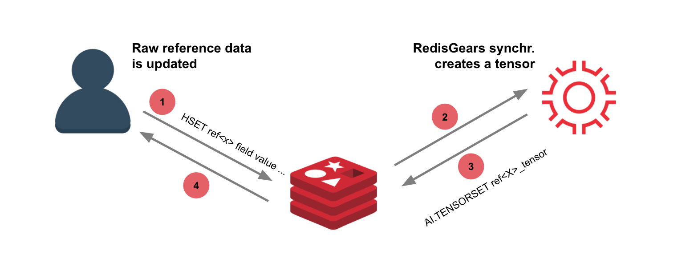
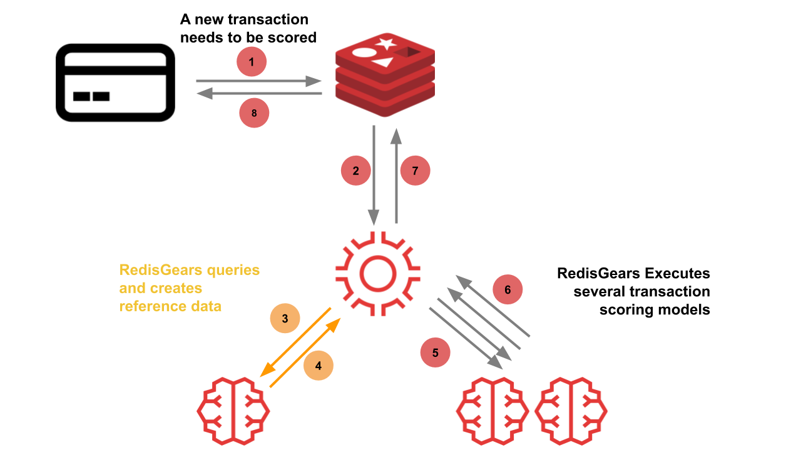
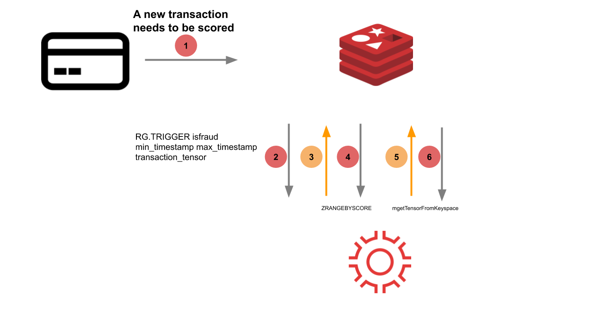
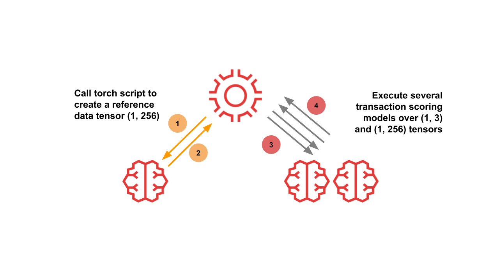
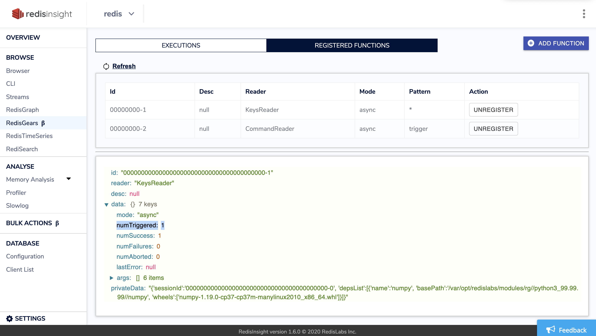
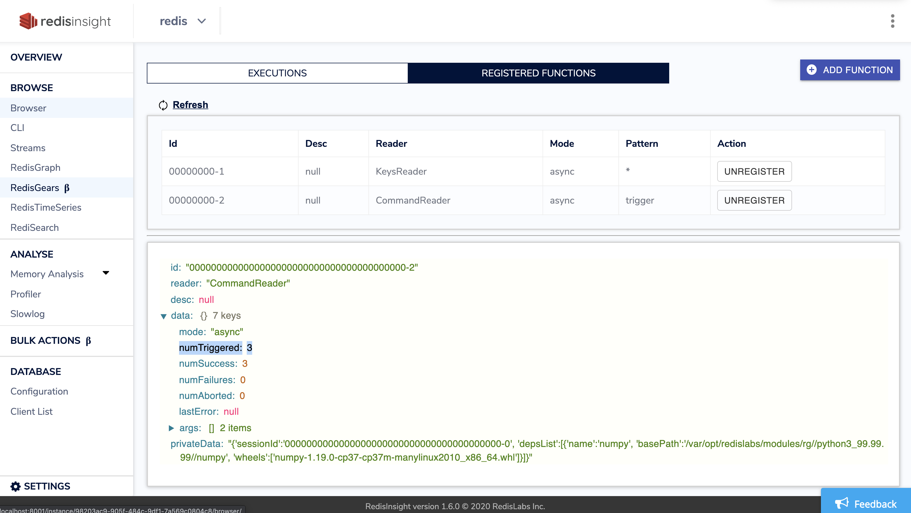
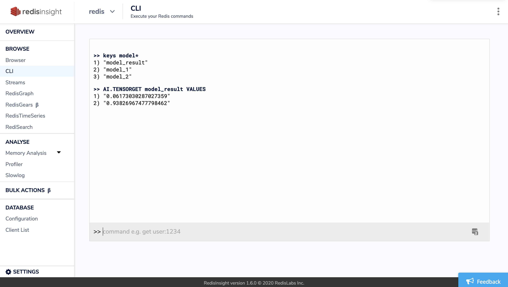

[](https://github.com/RedisAI/FraudDetectionDemo)
[](https://github.com/RedisAI/FraudDetectionDemo/actions?query=workflow%3ADocker-CI)
[](https://forum.redislabs.com/c/modules/redisai)
[](https://gitter.im/RedisLabs/RedisAI?utm_source=badge&utm_medium=badge&utm_campaign=pr-badge)

# FraudDetectionDemo

This demo combines several [Redis](https://redis.io) data structures and [Redis Modules](https://redis.io/topics/modules-intro)
to showcase the advantage of data locality during transaction scoring.

It uses:

* [RedisGears](https://oss.redislabs.com/redisgears/) to orchestrate the transactions and preprocessing the data by means of [functions](https://oss.redislabs.com/redisgears/functions.html)
* [RedisAI](https://oss.redislabs.com/redisai/) to preprocess the data and to run several DL/ML models

## Architecture
### Flow 1: Updating reference data
Raw reference data is kept in Redis that can be fed as input to DL/ML models.  In order to save processing time during inferencing, the raw reference data is converted into tensors on each update.

The reference data for the transaction scoring is modelled as Redis Hashes. A sorted set keeps track of the keynames of these hashes sorted by time.

A [first RedisGears function](https://github.com/RedisAI/FraudDetectionDemo/blob/master/app/gear.py#L47) is triggered on each update of the reference data. It registers to `SET` events of the type `hash`. This function itself is converting the hash into a tensor and stores it back into Redis (using the `hashToTensor` method).
`numpy` is used in the function to serialise the values of the hash into an
`ndarray` with a shape `(1, 30)` after which it's stored as a [RedisAI tensor](https://oss.redislabs.com/redisai/intro/#using-redisai-tensors).




### Flow 2: Transaction scoring
When a new transaction happens, it needs to be evaluated if it's fraudulent or not.  The ML/DL models take two inputs for this, the relevant reference data and the new transaction details.  RedisGears will orchestrate the fetching of the relevant reference data and creating a single input tensor out of it via a Torch Script.  Afterwards it will execute several inferences using TensorFlow models hosted inside Redis and combine the results to reply the transaction scoring result.



An input tensor is set in the keyspace with the shape of `(1, 30)`. A second RedisGears function is triggered with as input
- the keyname holding the new transaction details tensor
- a time range, represented by two timestamps.

The function then executes a range query over the sorted set ([`ZRANGEBYSCORE`](https://redis.io/commands/zrangebyscore)) and retrieves a list of hash names (recall that each hash has a corresponding tensor as described in Flow 1).



From this list it extracts a list of tensors from the keyspace and sends it to a [Torch script](https://github.com/RedisAI/FraudDetectionDemo/blob/master/app/script.torch). This torch script creates a
new tensor with the shape `(1, 256)`, by concatenating the tensors and either pad the remaining space or trimming it.
The new tensor is the reference data for the models which expect a reference data with shape of `(1, 256)` and transaction details tensor with the shape of `(1, 30)`. Once the inferencing of the models are done, the function uses `numpy` to aggregate the results and save them to a tensor
with shape `(1, 2)` that contains the probability for the transaction to be a fraud.



## Running the Demo
To run the demo:
```
$ git clone https://github.com/RedisAI/FraudDetectionDemo.git
$ cd FraudDetectionDemo
# If you don't have it already, install https://git-lfs.github.com/ (On OSX: brew install git-lfs)
$ git lfs install && git lfs fetch && git lfs checkout
$ docker-compose up
```
If something went wrong, e.g. you skipped installing git-lfs, you need to force docker-compose to rebuild the containers
```
$ docker-compose up --force-recreate --build
```

The `app` container will [load](https://github.com/RedisAI/FraudDetectionDemo/blob/master/app/app.py)
- The [two tensorflow models](https://github.com/RedisAI/FraudDetectionDemo/tree/master/app/models)
- The [Torch script](https://github.com/RedisAI/FraudDetectionDemo/blob/master/app/script.torch)
- The RedisGears functions

The `dataloader` container will [load](https://github.com/RedisAI/FraudDetectionDemo/blob/master/dataloader/load.py)
- 1000 [raw reference data points](https://github.com/RedisAI/FraudDetectionDemo/blob/master/dataloader/load.py#L29)
- 1000 [tensor](https://github.com/RedisAI/FraudDetectionDemo/blob/master/dataloader/load.py#L32) representations of these raw data points
- 1 [sorted set](https://github.com/RedisAI/FraudDetectionDemo/blob/master/dataloader/load.py#L35)

### Explore loaded reference data
This demo bundles a [RedisInsight](https://redislabs.com/redisinsight/) container which is an intuitive GUI for Redis. Open a browser and point it at https://localhost:8001 and select the preloaded redis connection.

In the CLI tool, execute the following command:
```bash
>> dbsize
(integer) 2004
```

The 2004 keys make up for
- 1000 raw reference data points
- 1000 tensor representations of these raw data points
- 1 sorted set
- 1 Torch script
- 2 Tensorflow models

### Exploring Flow 1
Select a key of a hash containing reference data in the Browser Tool and go back to the CLI. Notice that the commands will execute use two different keys:

- `478_2` the raw reference data.
- `478_2_tensor` the tensor counterpart of this raw reference data.

The following three commands will demonstrate that the tensor representation of the raw data is always kept in sync by RedisGears.  

1. `debug object 478_2_tensor` will allow you to inspect the last time the tensor key was touched (`lru_seconds_idle`).
1. Update a field in the raw data via the `HSET` command.
1. Debug the object again and notice that the `lru_seconds_idle` has now been updated.

```
>> debug object 478_2_tensor
"Value at:0x7f915600dc10 refcount:1 encoding:raw serializedlength:146 lru:16636612 lru_seconds_idle:69"
>> hset 478_2 Amount 123
(integer) 0
>> debug object 478_2_tensor
"Value at:0x7f915600dc20 refcount:1 encoding:raw serializedlength:146 lru:16636690 lru_seconds_idle:2"
```


When we inspect the Function in the RedisGears tool we can verify that the function was triggered exactly once.



### Exploring Flow 2
Open a second terminal to emulate a client application connecting to redis:
```
$ pip3 install -r example_client/requirements.txt
$ python3 example_client/client.py
```
This client will execute 3 commands to redis that simulate the transaction scoring:
1. `AI.TENSORSET` will set the transaction input data for the model.
1. `RG.TRIGGER` will trigger the second Function that will orchestrate Flow 2.
1. `AI.TENSORGET` will fetch the output result of the Function.

```bash
$ python3 example_client/client.py
[b'0.11767192184925079', b'0.8823280930519104']
Total execution took: 9.902238845825195 ms
```



